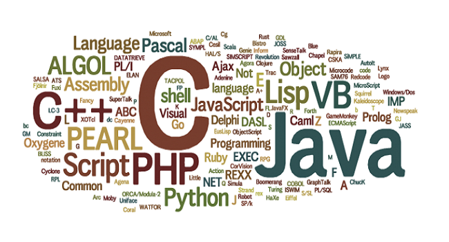

Throughout my experiences learning about the science of giving a machine commands, diversity of language seems to be the most important asset a programmer can have. This programming multilingualism broadens the scope of possibilities the individual can accomplish, understanding fundamental capabilities of each language. After observing the strengths and weaknesses of languages I'm familiar with so far with the confessions of advocates of the different structures, I can confidently suggest a "best" language does not exist but all have their strengths programmers can exploit. 

In my pursuit toward programming fluidity, introductions to new languages are met with excitement and an open mind to learn. My Java background reminds me of the similarities to JavaScript, but I notice much less words are needed to accomplish the same task. Leaner code is a satisfaction I frequently enjoy, so my first impression of JavaScript suggests it may become my new favorite language. From an engineering perspective, bestowing the methods of an innovation effectively is found in the ease of following the research: lean and efficient code delivers. Then again, my hypothesis might be completely wrong; which fuels my motivation to learn and strengthen my skills. 

Strengthening of mind or body is found in overcoming the discomfort of struggle. Athletic software engineering flexes and endures the necessary muscles to critically think under a fabricated level of stress. This fabrication will prepare its subjects for the hardships of the real world and through these trials we will expose our finest abilities: rejoice in success or learn through defeat. Effectiveness will rest on the shoulders of those who exploit it, I will not enjoy it but anticipate the glory of success when I defeat it. 
