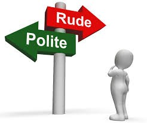

From the dawn of communication, mannerisms have dictated the ways we interact with one another. The exchange of ideas and messages maintained a funadmental courtesy with the way it was delivered. Much of these non-verbal methods of communication carried concepts like respect and temperment that could be received, creating a better environment for a message to be understood. With the utilization of technology, communication has gotten much faster and easier but at the expense of the etiquettes normally encasing them. As the culture of mass communications evolved over time, mannerisms 

