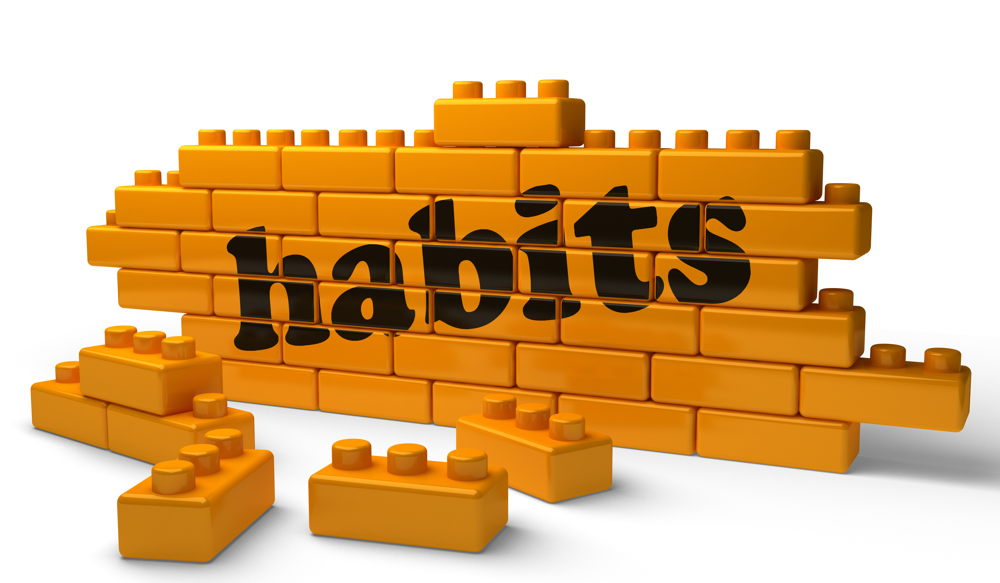

Throughout history, linguistics has been studied as systems of pattern recognition between entities to exchange information. These patterns would be impossible to function without fundamental standards understood by everyone involved. As communication evolved, new standards accepted and/or denied by the affected culture allowed innovations to find new meanings but never losing sight of the fundamental processes.  

The importance of these standards can be applied to fundamental coding practices that not only preserve the languages but allows them to evolve. Innovation stems from dynamic thinking from multiple viewpoints which risk suffocation by huddles in communcation. Strong coding habits enable colleagues and developers to be efficient, precise and innovative when conducting code tracing. The intrinsic value to the idea of coding standards can be found in the abundance of different styles of code quality control as well as the expectations set by dominant programming corporations: if there was no value there would be no interest. 

Code quality control is available from many different sources and targeted to certain demographics based on viewpoints of developers as "best practices". Sources like Eslint provide a "stick and carrot" process to regulating and enforcing coding fundamentals. Though it is time consuming and frustrating at first, the discomfort to conform subsides as corrections become habits. These repetitions reform bad coding habits into "easy to follow" processes to communicate to others who may be interested in viewing said code. Eventually the "stick" of red marks will turn into the gratification "carrot" of a green checkmark without need to correct any minuscule format discrepencies. The goal will be when habit turns into routine, the fundamental actions are second nature and proper coding etiquette become effortless. 

My introduction to eslint has been pleasant. Coding with google checkstyle developed a strong foundation for clean and concise coding, eslint has minor variations to its expectations but nothing that drastically detours from my normal coding practices. I take a small amount of gratification in the concept that I am able to become fluid to conform to different platforms while monitoring my timeframe to assimilate. A belief from Professor Philip Johnson of University of Hawaii at Manoa, *"I believe some coding standards can actually help you learn a programming language"* fostered a new belief within me: maybe I am willing and able to diversify my language portfolio because my strong fundamental concept of coding standards. These standards can extend to other languages, creating a beneficial link to encourage learning. 

