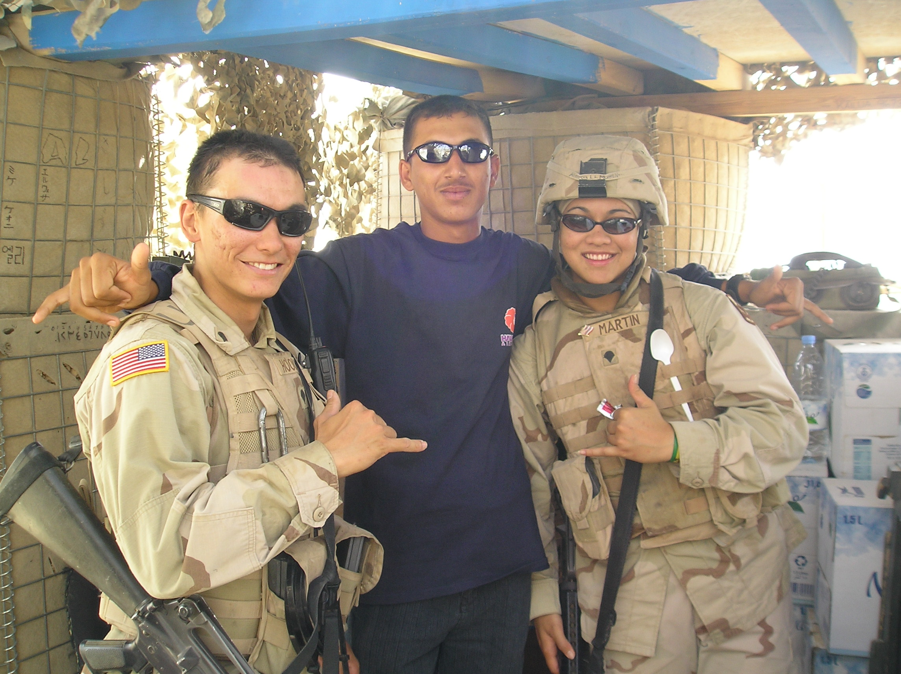
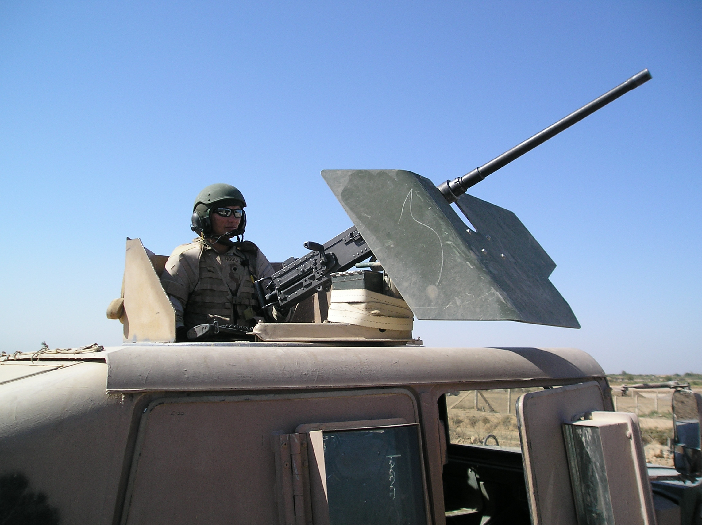
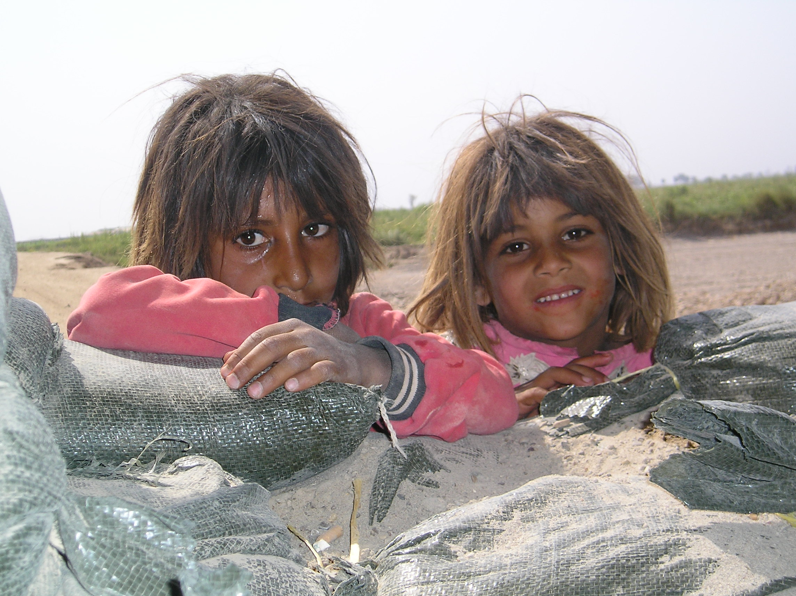

  
  
  
  

After the fall of Saddam Hussein, the United States of America was charged with the task of stabilizing the leaderless country of Iraq. President George W. Bush activated the Hawaii National Guard during Operation Iraqi Freedom 3 to assist with support operations in the city of Balad, approximately 50 miles south of Baghdad. 29th Brigade Combat Team (BCT) deployed for a 1 year iteration to secure forward operating base Anaconda and conduct support missions vital to campaign goals. 

I served with the first transportation platoon as a combat lifesaver, radio communications operator, demolitions itemizer, and equipment operater. As a combat lifesaver, I was tasked with immediate response to first aid when necessary. Anything from intravenous hydration to immediate response to a mass-casualty situation involving multiple Iraqi locals injured from a drive-by shooting. Demolitions itemizing is an effective way to find traces of explosive residue on people or equipment. If there was something questionable as an explosive threat, I would sweep the vehicle or person with a swab and utilize an itemizer to burn and read the chemicals that were on it providing a platform for risk assessment. Engaging with the locals was a focal point of the operation, to create a bubble of comfortablility with American's. Interaction with the locals through gift giving, employment, and fellowship was necessary to accomplish the overall mission we were sent their for.  
