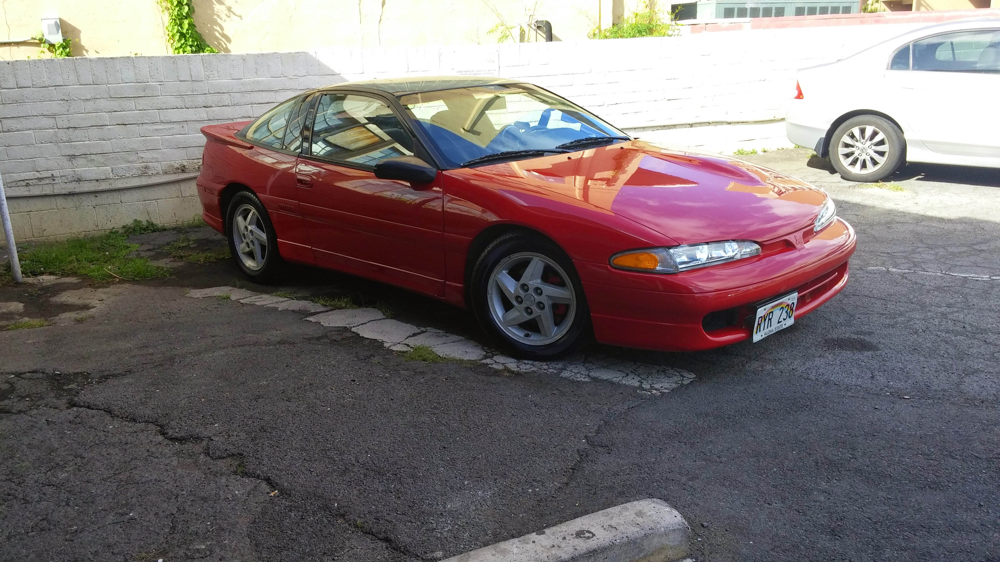
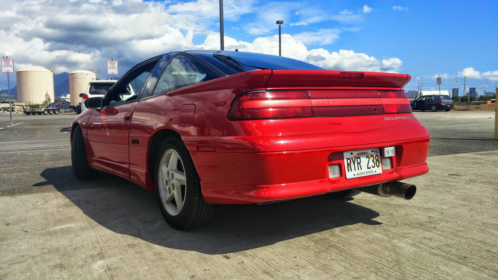
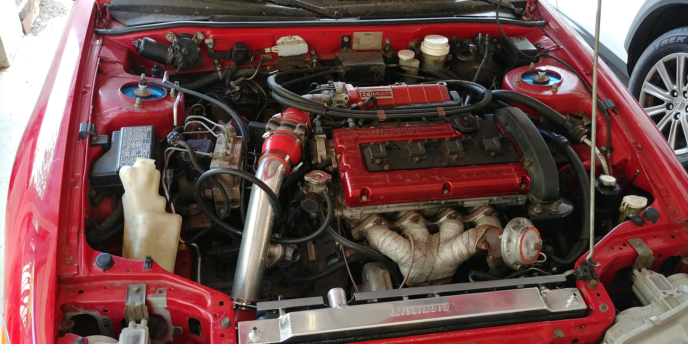

  
  
  

The 1993 Mitsubishi Eclipse GSX was part of Chryslers' performance line of 2-door vehicles; also known as an Eagle Talon and Plymouth Laser. It came with an all wheel drive transaxle powered by a 2.0L turbocharged engine pushing a base 195hp. Though small, the vast amount of possibilities the engine can withstand without major modification makes the Eclipse a predominant candidate amongst performance tuners. 

I shipped this Eclipse GSX in 2003 from a seller in Phoenix. It came with a stock platform with the exception of an upgraded turbocharger. 
