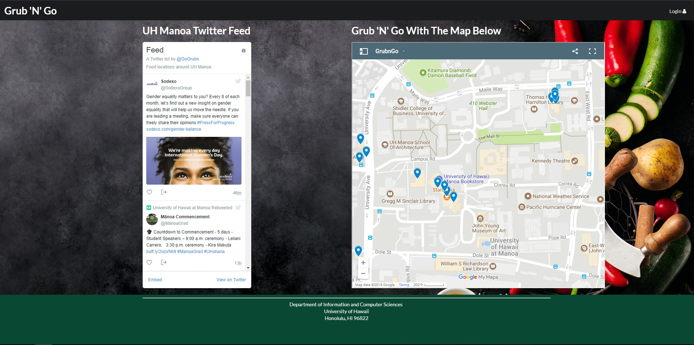

[Grub n' Go](https://grubngo.github.io/)
[Grub n' Go App](http://grubngo.meteorapp.com/#/)

As a fundamental need for survival, food is one of the few things needed to sustain life. Evolution has allowed us the luxury of having this necessity readily available with choices of ethnic type and minimal traveling to get it. A common dilemma that concerns both business owners and consumers around the University of Hawaii - Manoa is "where are these places"? 

Grub n' Go is a fast and convenient answer to this. It is designed to provide upfront information via an interactive map and live twitter feed.  Though creating an account opens more features to the site, the target demographic is non-members launching the app just for quick information and going to their destination. This high traffic based goal will build brand recognition with a dependance on users to return to the site to gain access to benefits from the twitter feed and the interactive map.  This rapport with the community will provide leverage to approach neighboring businesses to sell ad space or request exclusive discounts to Grub n' Go thus further promoting the brand. 

The interactive map is supported by Google Maps with predesignated pins to help users discover new venues are return to old ones. The map provides contact information, customer reviews, as well as directions based on the users current location. For viewing convenience, the guest can zoom in and out as well as move the map with their finger or mouse. As future venues populate or discontinue service, we are able to update the featured pins in real time as well as lead clicks with different types of pins for sponsoring partners.  

Next to the map is a live feed powered through twitter. Through Grub n' Go twitter feed, [GoGrubn](https://twitter.com/GoGrubn), visitors can scroll through discounts and deals provided by the vendors themself. Since this is a feed maintained by individual vendors, data update is minimal for Grub n' Go assets. 

My involvement with this project was found in the initialization of the corporation assets to sustain and maintain the application through Meteor Galaxy. Through this project, I secured my abilities in searching for resources like Google Maps and Twitter to give substance to the first impression of the application and website. Then embeding these resources into the landing page within the meteor platform. 
