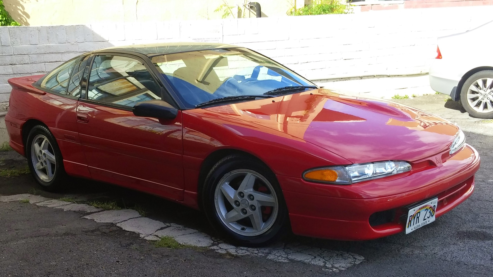
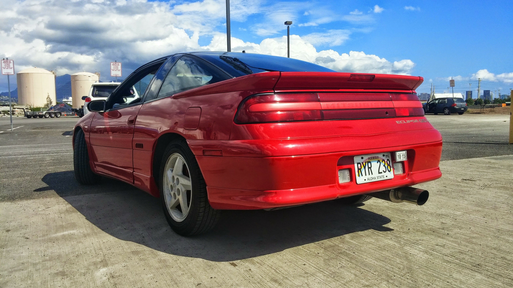

  

  
  

The 1993 Mitsubishi Eclipse GSX was part of Chryslers' performance line of 2-door vehicles; also known as an Eagle Talon and Plymouth Laser. It came with an all wheel drive transaxle powered by a 2.0L turbocharged engine pushing a base 195hp. Though small, the vast amount of possibilities the engine can withstand without major modification makes the Eclipse a predominant candidate amongst performance tuners. 

I shipped this Eclipse GSX in 2003 from a seller in Phoenix. It came with a stock platform with the exception of an upgraded turbocharger. Since then I have modified the vehicle to make its mechanical systems more efficient allowing a window to passively increase the performance. Efficiency modifications include removal of balance shafts, increasing turbo intercooler size, and direct route of pipings to decrease travel distance. 

The electronic aspect of the vehicle was monitored and controlled by a read only memory(ROM) electronic control unit (ECU), which has been switched out for a Eraseable Programmable Read Only Memory (EPROM) ECU. This allows a modern computer to access the information from the ECU and flash it with new parameters dependant on what is being tuned at the time. It also provides data the sensors is sending for troubleshooting and maintenance. This EPROM ECU is able to increase efficiency and reduce hydrocarbons with access to a newly installed wideband oxygen sensor. The data provided by this sensor allows the ECU to see the levels of oxygen in the exhaust to actively change fuel injection amounts to optimize a stoich mixture. This hybrid understanding between the mechanical physics and electrical manipulation allows me to have open access to learning and growing my understanding of auto mechanics. 
